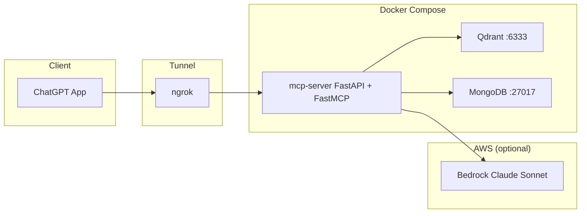
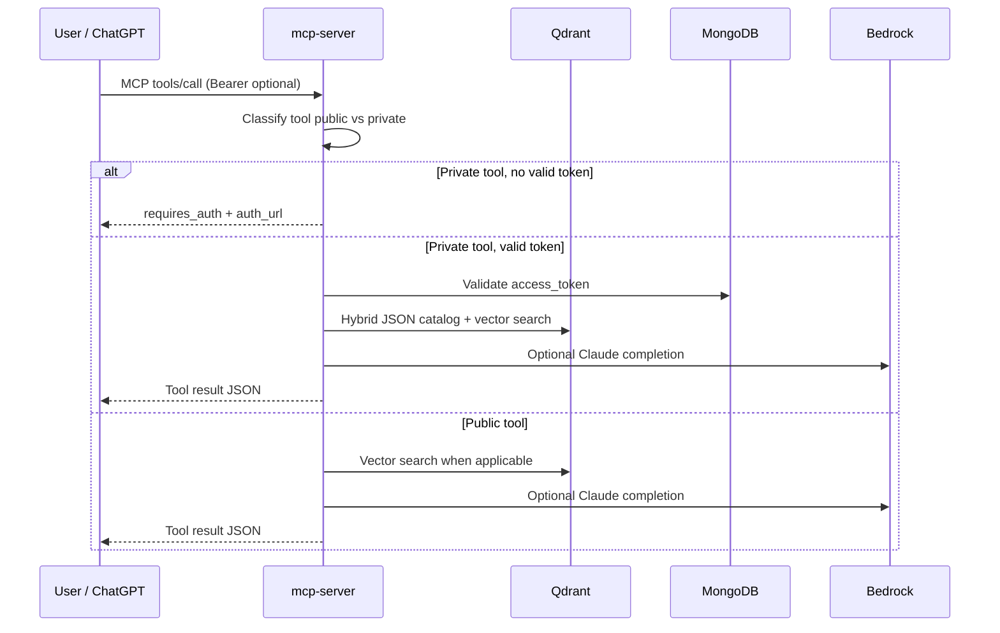

# Architecture

## High-level diagram

## Components

| Component | Role |
|-----------|------|
| **ChatGPT App** | Natural-language UI; invokes MCP tools over HTTPS (via ngrok URL). Caches OAuth bearer token in session after login. |
| **ngrok** | Publishes `localhost:8000` for remote MCP and OAuth redirects. |
| **mcp-server** | FastAPI application: OAuth2 mock (`/auth/*`), Streamable HTTP MCP under `/mcp`, health at `/health`. FastMCP registers public vs private tools. |
| **Qdrant** | Two collections: `public_catalog_docs`, `private_member_docs` (ingested markdown policies and FAQs). |
| **MongoDB** | Authorization codes (TTL), sessions (`session_id`, `access_token`, `user_id`, expiry). |
| **AWS Bedrock** | Optional Anthropic Claude Sonnet for `ask_*` tools; graceful retrieval-only fallback if credentials are missing. |

## Request flow (tool call)

## Design choices

- **Single origin:** OAuth and MCP share `PUBLIC_BASE_URL` so login links match the tunnel hostname ChatGPT opens.
- **Bearer propagation:** ASGI middleware copies `Authorization: Bearer` (or `?access_token=` for demos) into a context variable private tools read.
- **Explicit auth errors:** Private tools return structured JSON so the model can surface a login link instead of failing obscurely.
