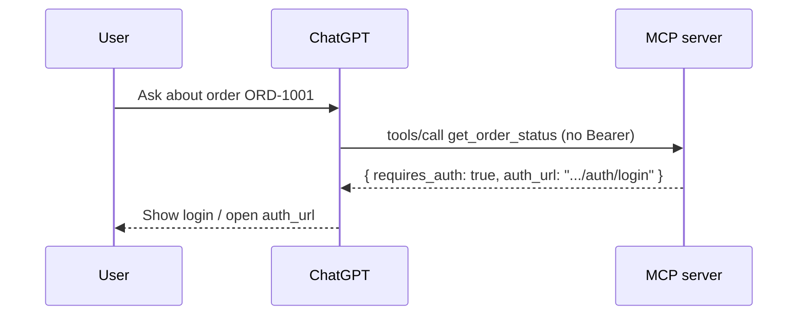
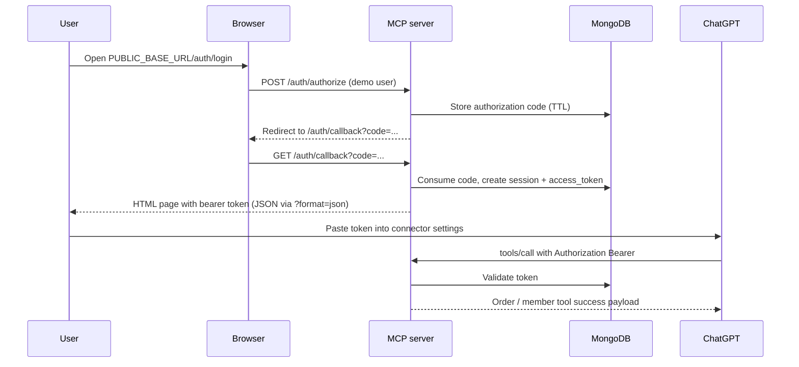

# Authentication flow

This POC implements an **OAuth2-style authorization code** flow with a **mock authorization server** embedded in `mcp-server`. Tokens and sessions persist in **MongoDB**.

## Sequence — unauthenticated private tool

## Sequence — authenticate and retry

## Token and session storage

| Store | Collection | Contents |
|-------|------------|----------|
| MongoDB | `oauth_codes` | Short-lived authorization `code`, `user_id`, `redirect_uri`, `client_id`, `expires_at` (TTL index) |
| MongoDB | `sessions` | `session_id` (cookie), `access_token` (Bearer), `user_id`, `expires_at` (TTL index) |

## HTTP endpoints

| Method | Path | Purpose |
|--------|------|---------|
| GET | `/auth/login` | Mock login form |
| POST | `/auth/authorize` | Issues code + redirects |
| GET | `/auth/callback` | Exchanges code for session; optional `?format=json` |
| POST | `/auth/token` | OAuth2 token endpoint (`grant_type=authorization_code`) |
| GET | `/auth/status` | JSON auth status |
| POST | `/auth/logout` | Revoke session |

## ChatGPT session caching

After login, the user (or connector configuration) should **cache the bearer token** for subsequent MCP requests. The MCP server remains stateless regarding ChatGPT; **MongoDB** holds authoritative session rows keyed by `access_token`.
